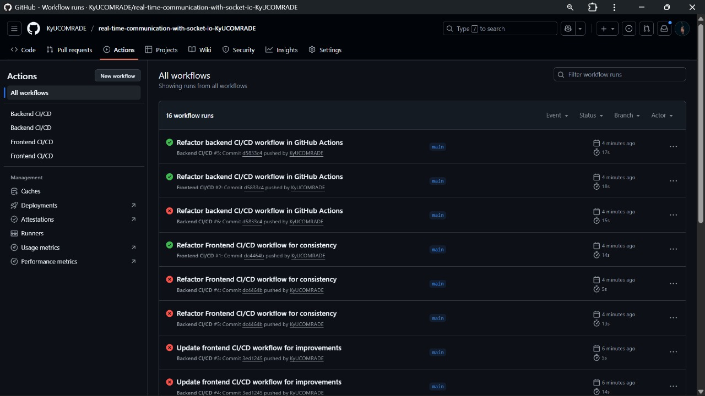
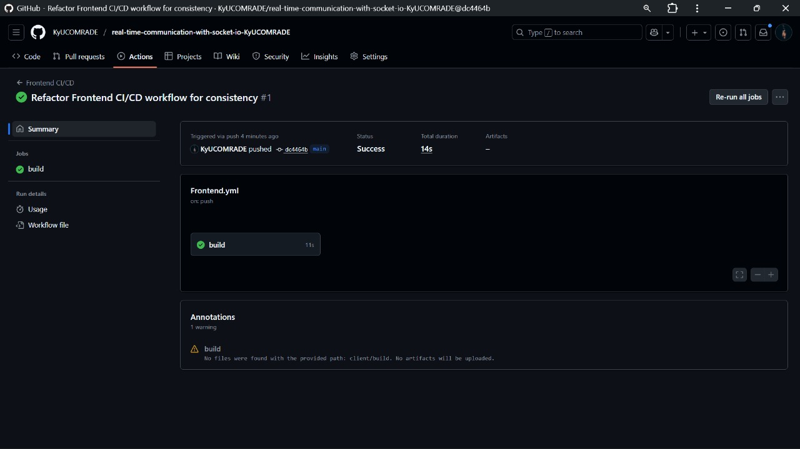
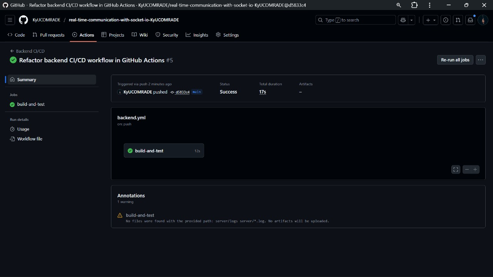
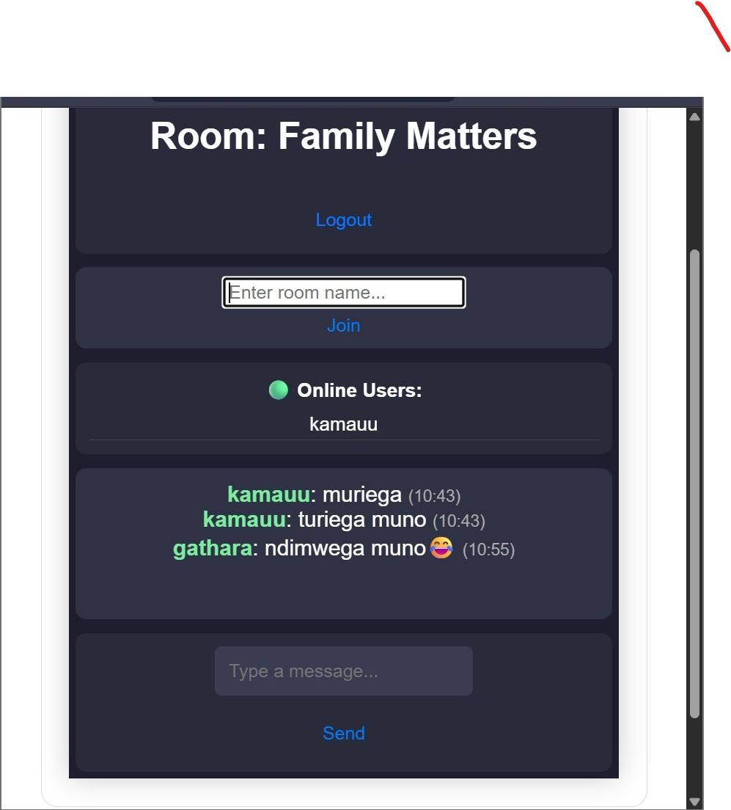

# 🚀 MERN App Deployment & CI/CD Setup

---

# 🤝 Contributing Guidelines

Thank you for your interest in contributing to this project!  
Contributions, issues, and feature requests are always welcome.

---

## 🧠 How to Contribute

### 1. Fork the Repository

Click the **Fork** button at the top right of the repository to create your own copy.

### 2. Clone Your Fork

```bash
git clone https://github.com/<your-username>/real-time-communication-with-socket-io-KyUCOMRADE.git
cd real-time-communication-with-socket-io-KyUCOMRADE

# Run backend
cd backend
npm install
npm run dev

# Run frontend
cd frontend
npm install
npm start
```
---

## 🚀 Deployment Instructions

### Backend (Render)

1. Push your backend code to GitHub.  
2. Create a new Render Web Service.  
3. Connect GitHub repository.  
4. Set environment variables on Render dashboard.  
5. Deploy the service.  
6. Enable HTTPS and monitoring.

### Frontend (Vercel)

1. Push your frontend code to GitHub.  
2. Import project on Vercel.  
3. Set build settings (`npm install`, `npm run build`) and environment variables.  
4. Deploy.  
5. Optional: Configure custom domain and caching strategies.

---

## ✅ Build Status

  -----------------------------------------------------------------------------------------------------------------------------------
  Service                               Status
  ------------------------------------- ---------------------------------------------------------------------------------------------
  **Frontend (Vercel)**                 

**Backend (Render)**                  
  -----------------------------------------------------------------------------------------------------------------------------------

------------------------------------------------------------------------

## 🧩 CI/CD Screenshots

### 1. GitHub Actions Overview



### 2. Frontend CI Successful Run



### 3. Backend CI Successful Run



### 4. Deployed App Previews

**Frontend (Vercel):**
<https://real-time-communication-with-socket-ten.vercel.app>



**Backend (Render):** <https://chat-app-v6gy.onrender.com>

------------------------------------------------------------------------
----------

---

# 🔧 Environmental Variables

### Backend (.env)

MONGO_URI=your_mongodb_connection_string (This one is a Secret)
PORT=5000
JWT_SECRET=your_jwt_secret

### Frontend (.env)

REACT_APP_API_URL=<https://chat-app-v6gy.onrender.com/>

---

## 🧩 Monitoring and Maintenance

We used **UptimeRobot** to monitor both frontend and backend uptime and performance.

### 🔹 Frontend Monitoring (Vercel)


### 🔹 Backend Monitoring (Render)


- Both monitors check uptime every 5 minutes.
- Alert notifications are sent on downtime.
- SSL certificates and response times are tracked.

---

### 🌍 Live Uptime Status

[View Live Status on UptimeRobot](https://stats.uptimerobot.com/TSqm3N1D7z)

---

## 🔮 Future Enhancements

- Integrate Docker for containerized deployment.
- Automate uptime checks with GitHub Actions.

---

MIT License

Copyright (c) [2025] [Joseph Chege]
